<br/><br/><br/><br/><br/><br/><br/>

# Eindproject: Intelligent sensorarray voor binnenklimaatmetingen

Dit is mijn eindproject genaamd: "Intelligent Sensor Systems". Het project bestaat uit een server en een aantal sensoren die met elkaar communiceren via het MQTT protocol. De server is verantwoordelijk voor het ontvangen van de data van de sensoren en het opslaan van deze data in een database en deze data weergeeft op een website. De sensoren zijn verantwoordelijk voor het meten van de temperatuur, luchtvochtigheid, luchtdruk en gas en het versturen van deze data naar de server.

## Inhoudsopgave
- [Voorbereiding](#voorbereiding)
  * [Server (Windows)](#server-windows)
  * [Sensors (Raspberry Pi Pico W)](#sensors-raspberry-pi-pico-w)
- [Gebruik](#gebruik)
    * [Server (Windows)](#server-windows-1)
    * [Sensors (Raspberry Pi Pico W)](#sensors-raspberry-pi-pico-w-1)
- [flowcharts](#flowcharts)
    * [sensor wifi.py](#sensor-wifipy)
    * [sensor mqtt.py](#sensor-mqttpy)
    * [sensor bme680.py](#sensor-bme680py)
    * [sensor main.py](#sensor-mainpy)
    * [server mqtt.py](#server-mqttpy)
    * [server database.py](#server-databasepy)
    * [server web.py](#server-webpy)
    * [server main.py](#server-mainpy)

## Voorbereiding

### Server (Windows)
- Installeer [mosquitto mqtt](https://mosquitto.org/download/)
- Kopieer het [mosquitto.conf](server/mosquitto.conf) bestand in de server map naar C:\Program Files\mosquitto
- Installeer python
- Installeer de benodigde python packages:
```powershell
pip install -d requirements.txt
```

### Sensors (Raspberry Pi Pico W)
- Installeer [Thonny](https://thonny.org/)
- Installeer Micropython op de pico W via Thonny.

## Gebruik

### Server (Windows)
Voor het starten van de server:
```powershell
python main.py
```

### Sensors (Raspberry Pi Pico W)

## flowcharts

### sensor wifi.py

- Functie : connect_wifi(ssid,password)
- Doel : Connectie maken met het wifi netwerk.
- Parameters : ssid (str), password (str)
- Returnwaarde : void
- Te installeren headers: network, time
- Flowchart: 

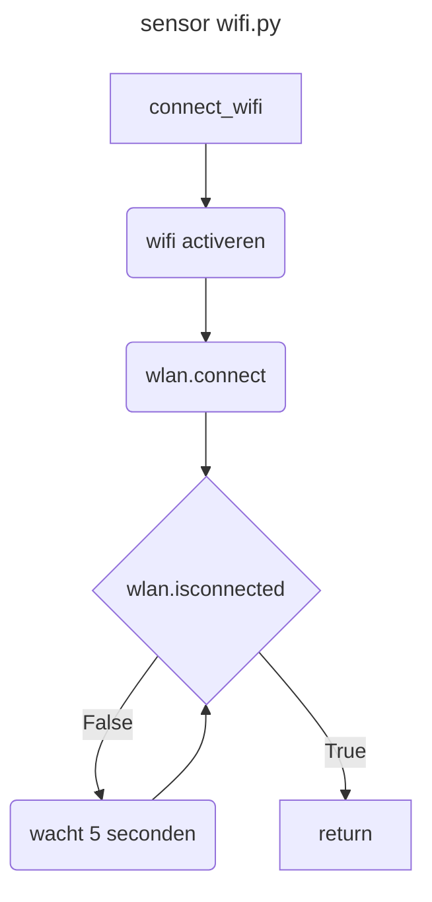

### sensor mqtt.py

- Functie : connect_mqtt(client_id,server,port)
- Doel : Connectie maken met de mqtt server.
- Parameters : client_id (str), server (str), port (int)
- Returnwaarde : client (mqtt.Client)
- Te installeren headers: umqtt.simple
- Flowchart: 

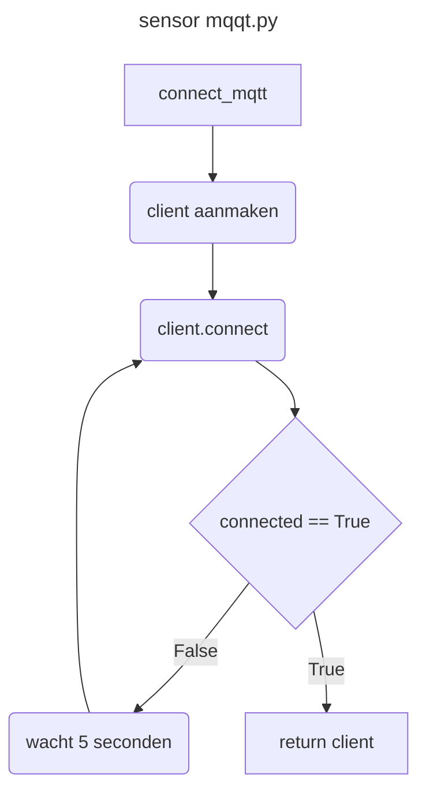

- Functie : publish_meeting(client,meeting,topic)
- Doel : Vezend een meeting naar de mqtt server.
- Parameters : client (mqtt.Client), meeting (Meeting), topic (str)
- Returnwaarde : void
- Te installeren headers: umqtt.simple
- Flowchart: 

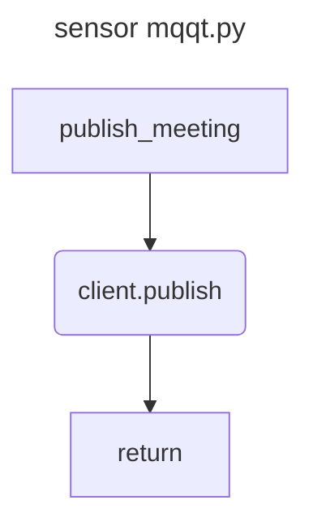

### sensor bme680.py

- Klassen : Meeting, Sensor
- Doel : De Meeting klasse bevat de data van een meeting en de Sensor klasse bevat de data van een sensor.
- Parameters : Meeting: temperatuur (float), luchtvochtigheid (float), luchtdruk (float), gas (float), x (float), y (float), tijd (Time), sensor_id (str)
- Parameters : Sensor: x (float), y (float), sensor_id (str), i2c (i2c), bme (BME680_I2C), uart0 (UART)
- Returnwaarde : Meeting, Sensor
- Te installeren headers: bme680lib, machine, utime, time, json
- Flowchart: 

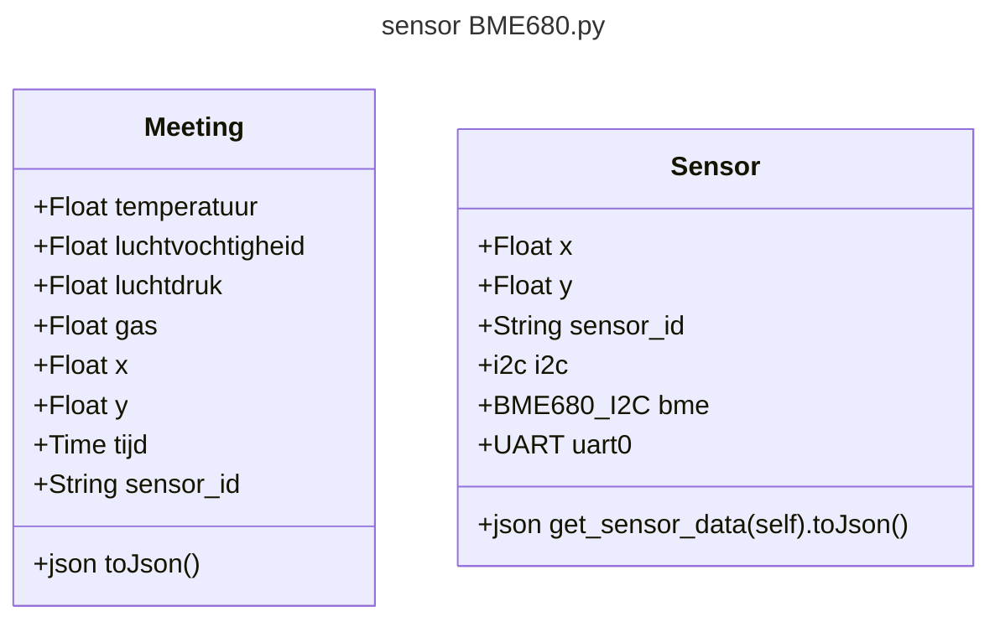

### sensor main.py

- Functie : main()
- Doel : De main functie van het programma.
- Parameters : void
- Returnwaarde : void
- Te installeren headers: time, wifi, mqtt, bme680
- Flowchart: 

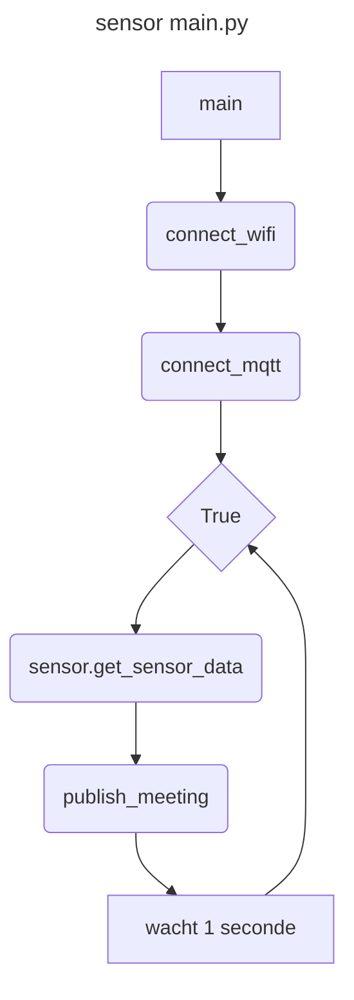

### server mqtt.py
- Klassen : MQTTBROKER, MQTTCLIENT
- Doel : De MQTTBROKER klasse bevat de data van een mqtt broker en de MQTTCLIENT klasse bevat de data van een mqtt client.
- Parameters : void
- Returnwaarde : MQTTBROKER, MQTTCLIENT
- Te installeren headers: paho.mqtt, time, subprocess, os, json, constants, database
- Flowchart: 

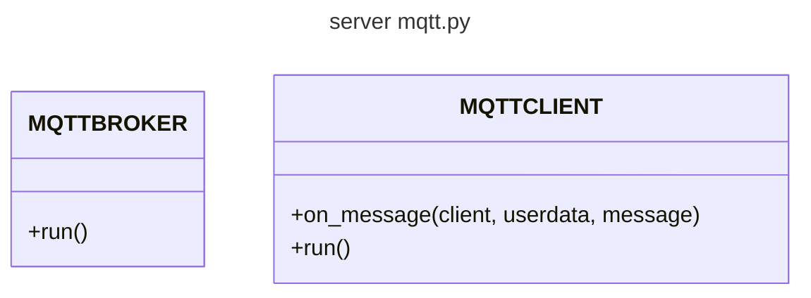

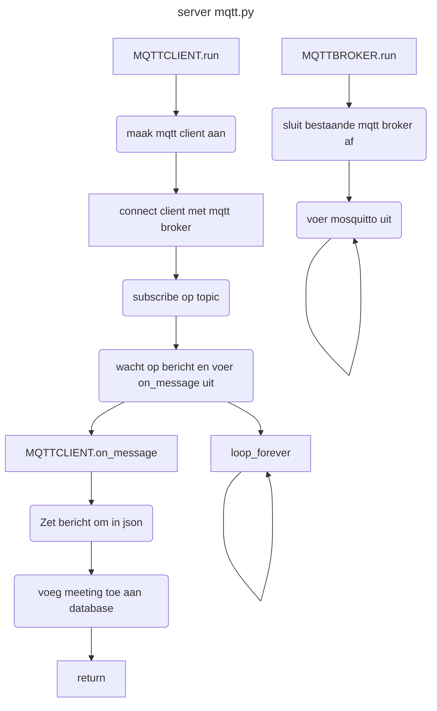

### server database.py
- Klassen : Database
- Doel : De Database klasse bevat de functie om om te communiceren met de database.
- Parameters : db_file (str)
- Returnwaarde : Database
- Te installeren headers: time, sqlite3, json
- Flowchart: 

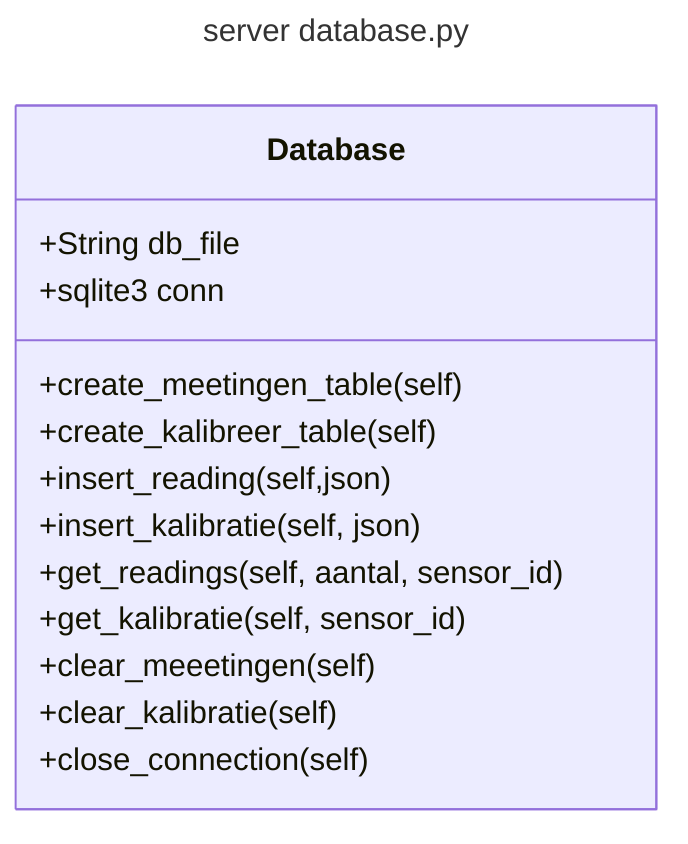

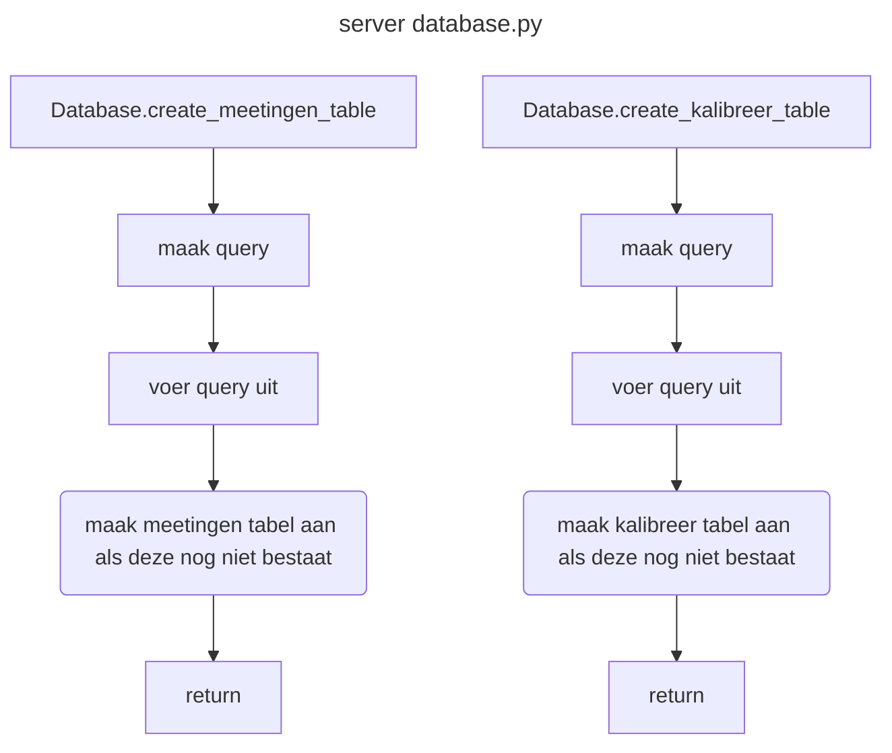

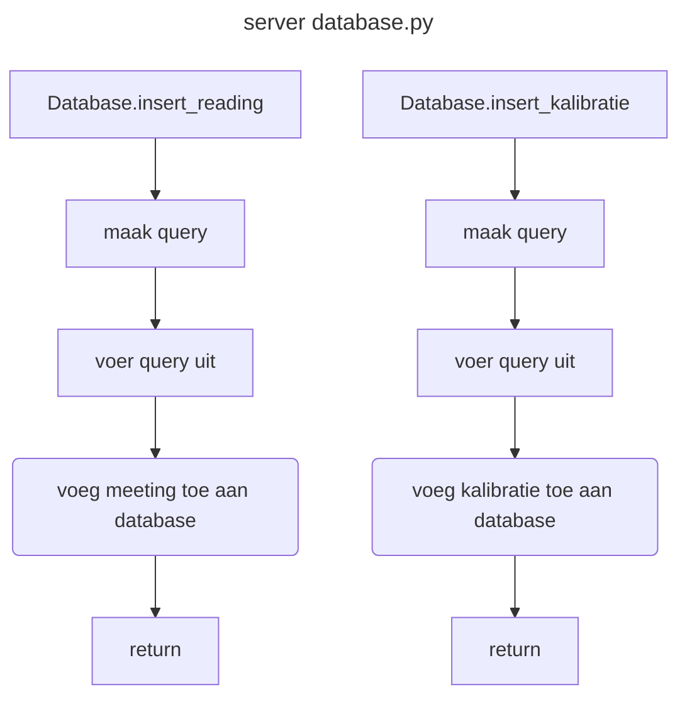

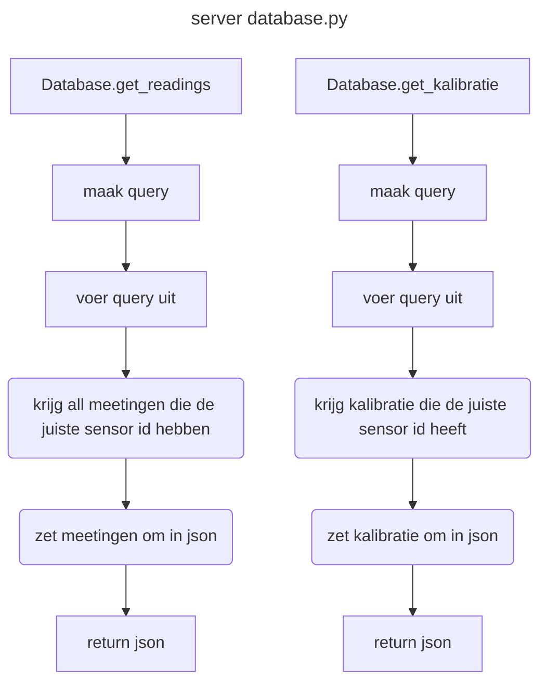

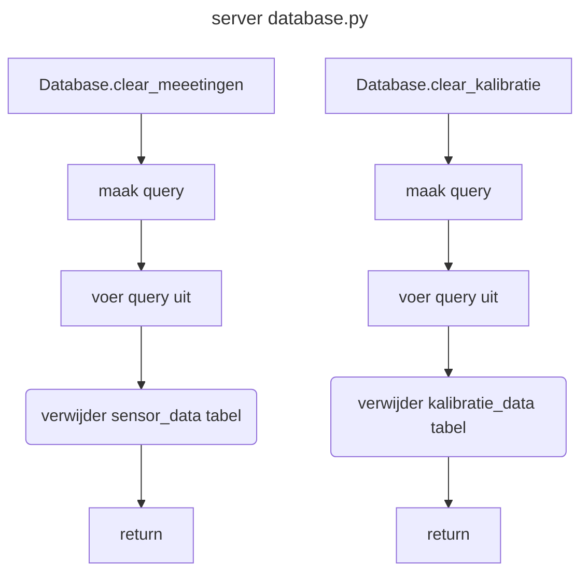

### server web.py

- Klassen : WebServer
- Doel : De WebServer klasse bevat functies om een webserver te maken.
- Parameters : BaseHTTPRequestHandler
- Returnwaarde : WebServer
- Te installeren headers: http.server, time, json, constants, database
- Flowchart: 

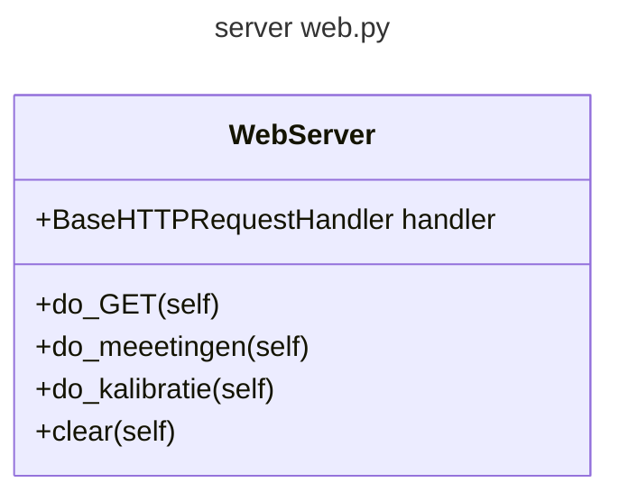


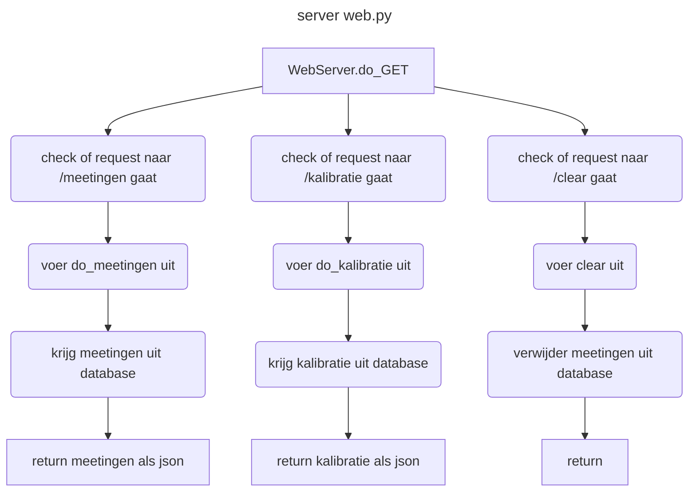

- Functie : run_server()
- Doel : Start de webserver.
- Parameters : void
- Returnwaarde : void
- Te installeren headers:
- Flowchart: 

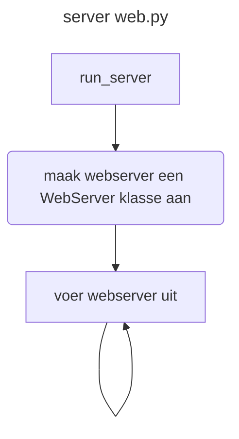


### server main.py
- Functie : main()
- Doel : De main functie van het programma.
- Parameters : void
- Returnwaarde : void
- Te installeren headers: time, threading, web, mqtt
- Flowchart: 

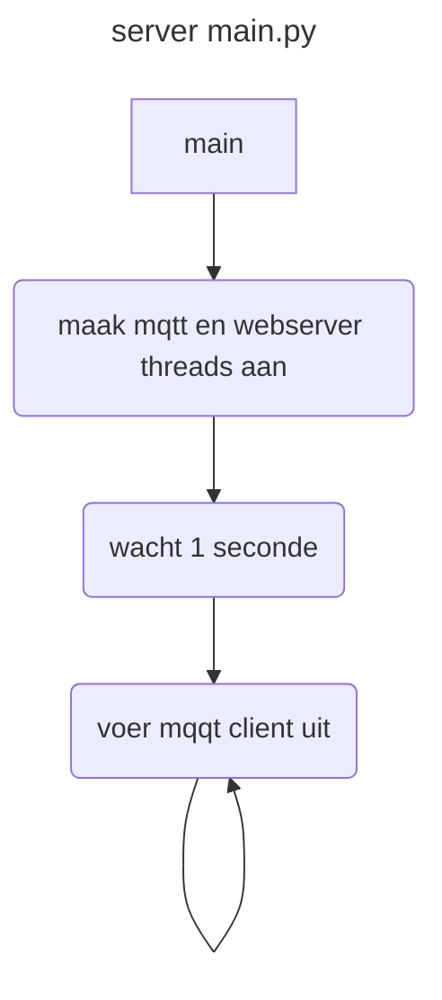
